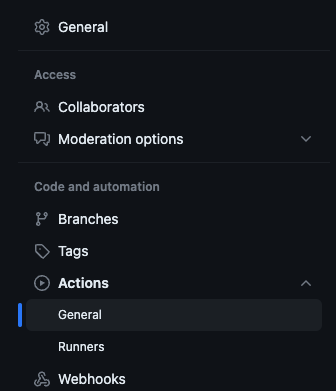
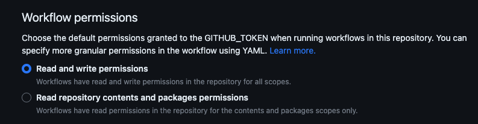

## Overview

github action purposing on making coverage badge for jest,  
super convinently.

> combine 2 action [jest-bades-action](https://github.com/jpb06/jest-badges-action)
> and  
> [github-pages-deploy-action](https://github.com/JamesIves/github-pages-deploy-action)

if you put ci steps in 2 line, then badge automatically uploaded to your repo.  
and put the url to your page. (ex. README.md)  

then whenever update your code (pushed) then coverage will be updated imediately.

## 🚀 Example

[](https://nolleh.github.io/simple-csv-parser/badges/coverage-branches.svg?raw=true)
[](https://nolleh.github.io/simple-csv-parser/badges/coverage-functions.svg?raw=true)
[](https://nolleh.github.io/simple-csv-parser/badges/coverage-jest%20coverage.svg?raw=true)
[](https://nolleh.github.io/simple-csv-parser/badges/coverage-lines.svg?raw=true)
[](https://nolleh.github.io/simple-csv-parser/badges/coverage-statements.svg?raw=true)

it looks like only work for 100% badge, but actually cacluated..   
(cause this example -simple-csv-parser- cover 100%)...   
other example.  

[](https://nolleh.github.io/nestjs-test/badges/coverage-jest%20coverage.svg?raw=true)


```markdown
[](https://nolleh.github.io/simple-csv-parser/badges/coverage-jest%20coverage.svg?raw=true)
```

## No Need Headache For Permission

don't be bothered to permission for your repository (token or private repo or whatever)  
because this badge file no need to uploaded to elsewhere but your repo.

## 📝 Usage

add to your github action...

1. run test to make json-summary
in your package.json or jest.config.json, add json-summary

```json
{
  "jest": {
    "coverageReporters": ["json-summary", "text"]
  }
}
```
2. add jest-badge-deploy-action

```yaml
name: ci
on: [push]
jobs:
  test-and-push-badge:
    runs-on: ubuntu-latest
    steps:
      - uses: actions/checkout@v3
      - uses: actions/setup-node@v3
        with:
          node-version: "16"
      - name: Install
        run: |
          npm install -g pnpm
          pnpm i
      - name: Test and Cov
        run: pnpm test:cov

      ### this step!
      - name: generate badge and pub 2 github pages
        uses: nolleh/jest-badge-deploy-action@v1.0.3
```

in your markdown (README.md)  
import your gh-pages branches svg.

> ⚠️ NOTE: you should change the repo path (simple-csv-parser...) to yours.

```markdown
[](https://nolleh.github.io/simple-csv-parser/badges/coverage-jest%20coverage.svg?raw=true)
```

## ⚙️  How It Works

- gh-pages branch is special branch in github to upload static files. (deployed)
- by using jest:json-summary, generate badge.
- the generated badges pushed to the special branch (gh-pages)
- these all process worked in your ci workflow, and it has permission to your repository.
- *Booyah*!


## 🤔 Trouble Shoot

ci can be fails with
```
remote: Permission to nolleh/simple-csv-parser.git denied to github-actions[bot].
fatal: unable to access 'https://github.com/nolleh/simple-csv-parser/': The requested URL returned error: 403
```

make sure ci can access your repo. (to commit/push)

1. go to repository settings > Actions > general

   

2. scrolls down to `workflow permission`, and check 'Read and write permissions'
  - this will be applied to your .github/workflow's permission.  

   
